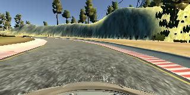
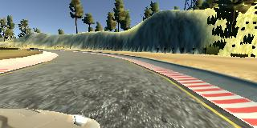

# **Behavioral Cloning** 

**Behavioral Cloning Project**

The goals / steps of this project are the following:
* Use the simulator to collect data of good driving behavior
* Build, a convolution neural network in Keras that predicts steering angles from images
* Train and validate the model with a training and validation set
* Test that the model successfully drives around track one without leaving the road
* Summarize the results with a written report

### Project files

My project includes the following files:
* model.py containing the script to create and train the model
* drive.py for driving the car in autonomous mode
* model.h5 containing a trained convolution neural network 
* writeup.md summarizing the results

#### Autonomous mode
Using the Udacity provided simulator and my drive.py file, the car can be driven autonomously around the track by executing 
```sh
python drive.py model.h5
```

#### Convolution Neural Network

The model.py file contains the code for training and saving the convolution neural network. The file shows the pipeline I used for training and validating the model, and it contains comments to explain how the code works.


### Model Architecture and Training Strategy

#### Model architecture

I chose the Nvidia convolution neural network architecture as a base architecture:

| Layer 				 |     Description								| 
|:----------------------:|:--------------------------------------------:| 
| Input					 |												| 
| Normalization Layer	 |												| 
| Convolution Layer 1  	 | 5x5 kernel, 2x2 stride, RELU activation 		|
| Convolution Layer 2  	 | 5x5 kernel, 2x2 stride, RELU activation 		|
| Convolution Layer 3  	 | 5x5 kernel, 2x2 stride, RELU activation 		|
| Convolution Layer 4  	 | 3x3 kernel, RELU activation 					|
| Convolution Layer 5  	 | 3x3 kernel, RELU activation 					|
| Fatten				 |												|
| Fully connected Layer 1| Output: 100 neurons							|
| Fully connected Layer 2| Output: 50 neurons							|
| Fully connected Layer 3| Output: 10 neurons							|
| Fully connected Layer 4| Output: 1 neurons							|


While testing out this architecture i made a few changes by addig the following layers:

* Lambda layer for data normalization
* Cropping2d layer for image cropping 
* Dropout layer to reduce the overfitting.

The final architecture:

| Layer 				 |     Description								| 
|:----------------------:|:--------------------------------------------:| 
| Input					 | 160x320x3 RGB image 							| 
| Normalization Layer	 |  											|
| Cropping2D Layer		 | Crop image top 50 pixels, bottom 20 pixels 	| 
| Convolution Layer 1  	 | 5x5 kernel, 2x2 stride, Valid padding		|
| RELU activation 		 |												|
| Convolution Layer 2  	 | 5x5 kernel, 2x2 stride, Valid padding		|
| RELU activation 		 |												|
| Convolution Layer 3  	 | 5x5 kernel, 2x2 stride, Valid padding		|
| RELU activation 		 |												|
| Convolution Layer 4  	 | 3x3 kernel, 2x2 stride, Valid padding		|
| RELU activation 		 |												|
| Convolution Layer 5  	 | 3x3 kernel 2x2 stride, Valid padding			|
| RELU activation 		 |												|
| Dropout 				 | 20% to reduce overfitting					|
| Fatten				 | 												|
| Fully connected Layer 1| Output: 100 neurons							|
| Fully connected Layer 2| Output: 50 neurons							|
| Fully connected Layer 3| Output: 10 neurons							|
| Fully connected Layer 4| Output: 1 neuron								|


#### Model parameter tuning

The model is using an adam optimizer, so the learning rate was not tuned manually and a mean square error as a loss function. 

#### Training data

Training data was chosen to keep the vehicle driving on the road. I used a combination of center lane driving, smooth left and right turn driving and counter-clockwise driving.

To capture good driving behavior, I first recorded two laps on track one using center lane driving and focusing to capture smooth turning datas.

I then recorded a counter-clockwise driving so that i would have more right turning data  

Samples of the left, center and right camera captures:




After the collection process, I had 12734 number of data points. Then, i preprocessed this data with a lambda fuction, where the image data is divided by 255 and subtracting it by 0,5. Also, i cropped the images, 50 pixels from the top and 20 pixels from the bottom.

I finally randomly shuffled the data set and put 20% of the data into a validation set. 

I used this training data for training the model. The validation set helped determine if the model was over or under fitting. The ideal number of epochs was 2, because after the 2nd epoch the validation loss is going up and down which is a sign that the model maybe overfitting the training data

The final result:
[Autonomous_car_driving](https://youtu.be/Ye1l_cX-hd8)